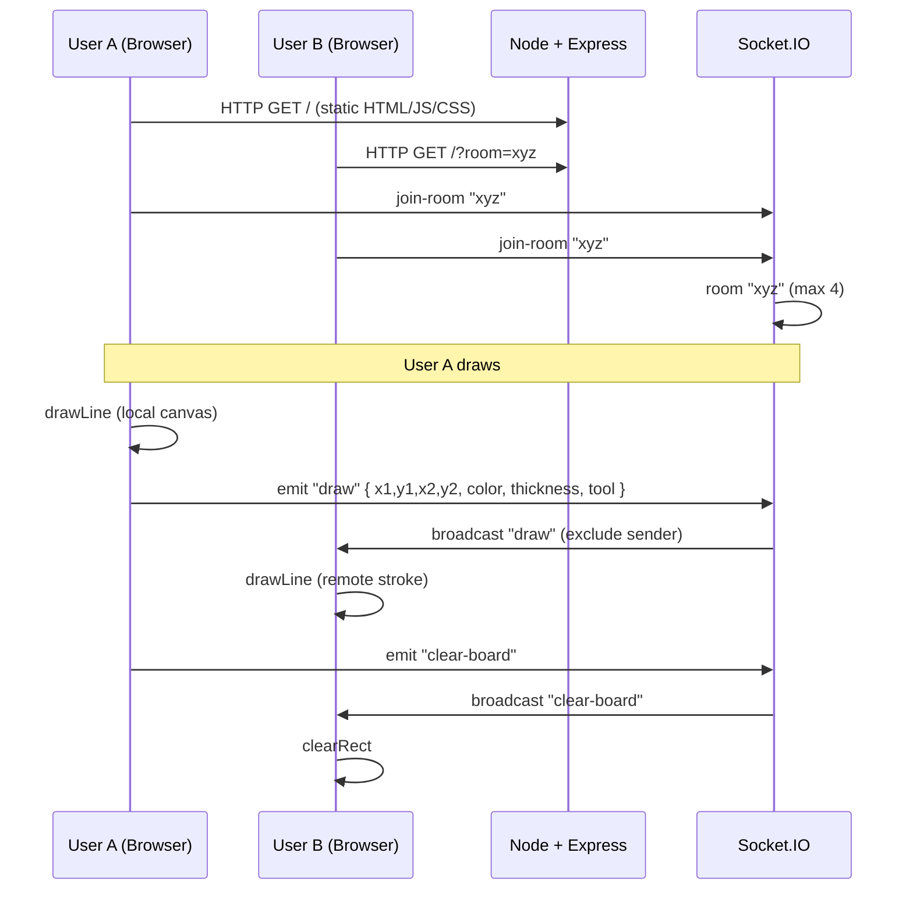

# Canvas

Real-time collaborative whiteboard: multiple users draw on a shared canvas with sub-second sync, room-based isolation, and no sign-up.

---

**Live Demo:** [https://canvas-rwax.onrender.com](https://canvas-rwax.onrender.com)

Share the same URL (or add `?room=your-room-id`) with others to collaborate in the same room.

---

## Problem

Ad-hoc collaboration (brainstorming, pair debugging, interviews) often needs a shared drawing surface without accounts, installs, or heavy tools. Browser-based whiteboards either lack real-time sync or depend on proprietary backends. This project provides a minimal, open stack: HTML5 Canvas + WebSockets, room-based, deployable anywhere.

## Key Features

- **Room-based collaboration** — Join via `?room=<id>`. Same room ID = same board. No auth.
- **Real-time stroke sync** — Draw events broadcast over Socket.IO; other clients render immediately.
- **Pen, eraser, color, thickness** — Toolbar with color picker and brush size (1–20px).
- **Clear board** — One user clears; all clients clear. Keeps sessions in sync.
- **Cap at 4 users per room** — Avoids overload; configurable in server.
- **Mouse and touch** — Works on desktop and mobile; canvas is responsive.
- **Stateless server** — No canvas state stored server-side; clients are source of truth after sync.

## Tech Stack

| Layer      | Technologies |
|-----------|--------------|
| Frontend  | HTML5 Canvas, vanilla JavaScript, CSS3 (custom properties, backdrop-filter), Lucide Icons, Socket.IO client |
| Backend   | Node.js, Express 5, Socket.IO 4 |
| Infra     | Static asset serving (Express), WebSocket upgrade on same origin; demo hosted on Render |

## System Architecture



Flow: user input → client canvas + Socket emit → server relay by room → other clients render. No persistence.

## How It Works

1. **Load** — Client gets `index.html`; script reads `?room=` or uses `"default"`, then emits `join-room`.
2. **Join** — Server checks room size (max 4). If full, client gets `room-full` and can reload or try another room.
3. **Draw** — On mouse/touch move while drawing, client computes segment `(x1,y1)→(x2,y2)`, draws locally, and emits `draw` with color, thickness, and tool. Server broadcasts to other clients in the same room; they call `drawLine` with the same payload.
4. **Clear** — On clear, client clears local canvas and emits `clear-board`; server broadcasts; everyone clears.
5. **Responsive** — Canvas resizes on window resize; coordinates are normalized to canvas space for consistent strokes across devices.

## Installation & Setup

### Local

```bash
git clone https://github.com/YOUR_USERNAME/canvas.git
cd canvas
npm install
npm start
```

Server listens on `http://localhost:3000`. Open in two tabs (or two devices on the same network) with the same URL to test collaboration.

### Production (e.g. Render)

- Connect the repo to Render; create a **Web Service**.
- Build: none. Start: `npm start` (or `node server.js`).
- The server listens on `process.env.PORT` (Render sets this); no extra config needed.
- No database or env vars required for basic use.

## Usage Examples

- **Same room (default):**  
  Person A: `https://your-app.onrender.com`  
  Person B: `https://your-app.onrender.com`  
  Both are in room `"default"`.

- **Named room:**  
  Person A: `https://your-app.onrender.com?room=interview-1`  
  Person B: `https://your-app.onrender.com?room=interview-1`  
  Isolated from default and other rooms.

- **Tools:** Color picker and thickness slider set stroke style. Pen (default) vs eraser toggle. Clear wipes the board for everyone in the room.

## Limitations & Future Improvements

- **No persistence** — Refresh loses the board. Future: optional stroke log or snapshot (e.g. Redis/DB or in-memory with TTL) for replay or save/restore.
- **No undo/redo** — Per-stroke undo would require ordered stroke storage and broadcast of undo events.
- **Max 4 users** — Simple guard; could be made configurable or replaced with a per-room rate limit.
- **Single server** — Horizontal scaling would need sticky sessions or a Socket.IO adapter (Redis) so rooms stay consistent across instances.
- **No auth** — Anyone with the room ID can draw. For sensitive use, add tokens or invite-only links.

## Contribution Guidelines

1. Open an issue for bugs or feature ideas so we can align on scope.
2. Fork, branch from `main`, and make changes. Keep the stack minimal (no new frameworks unless justified).
3. Run the app locally; test with two clients (e.g. two tabs) for draw and clear.
4. Submit a PR with a short description and reference any issue. One logical change per PR.

## License

ISC.
